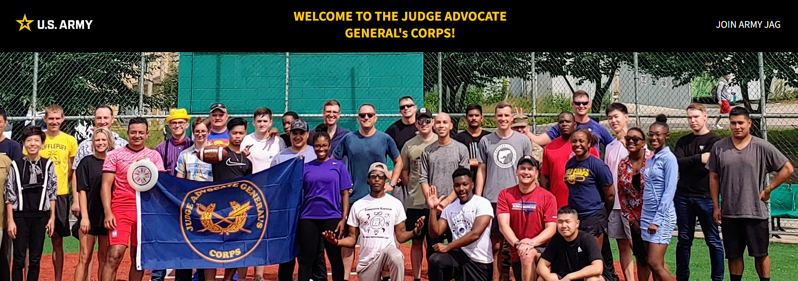
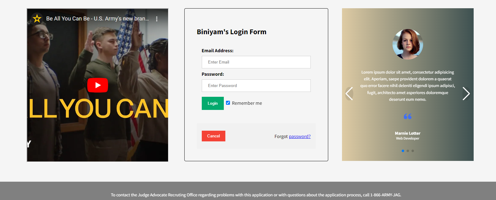

# Log-In-Form

# Table of Contents
- [Log-In-Form](#log-in-form)
- [Table of Contents](#table-of-contents)
  - [GitHub Username](#github-username)
  - [Email](#email)
  - [Description:](#description)
  - [Usage](#usage)
  - [Built-With](#built-with)
  - [Licenses](#licenses)
  - [Deployed](#deployed)

## GitHub Username
[Mike Sowers](https://github.com/msowers72)

## Email
<msowers72@yahoo.com>

## Description:
This application allows you to apply for membership in the U.S.ARMY'S Judge Advocate General's Coprs.

## Usage
As a user, I can submit an online application for membership in teh U.S.ARMY'S Judge Advocate General's Coprs .

## Built-With
* HTML
* CSS
* JavaScript
* Google-Fonts
* Boxicons
* Swiper CDN

   

## Licenses 

<!--  -->
  
 ## Deployed
 [Online Application](https://msowers72.github.io/Search-Tool/)
 
 
  
  
 

